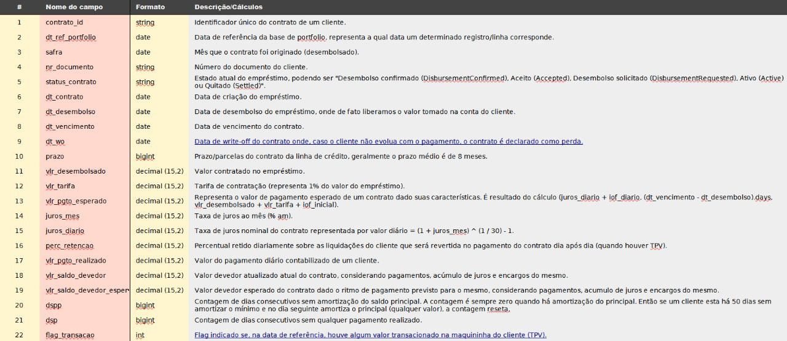

# Resumo e Insights do Projeto
## Introdução

Essa parte foi criada para resumir o entendimento do negócio e do projeto a ser desenvolvido também!

Caso alguma hora fique um pouco confuso ou a lógica seja perdida, esse material será de apoio para quem estará realizando.

É separado no resumo, insights, e visualização das tabelas e arquivos presentes.

## Resumo:

#### Mapa de Variáveis:

## Pergunta:

#### Como é o cálculo do empréstimo?

Através da seguinte fórmula:

emprestimo = (percentual de retencao) / (transacoes realizadas pela maquina)

E um cliente pode fazer mais de um contrato de empréstimo, sendo que o anterior tem que estar em dia.

#### Qual é a curva ideal de vezes que acionamos um cliente?

O foco é em recuperar clientes que tiveram problemas no ritmo do pagamento.

E com base nisso temos alguns pontos a serem citados sobre acionamento e cliente:

Quando o cliente começa a ter problema pra pagar os contratos ele é elegivel a ser acionado, o acionamento pode ser feito tanto por email quanto por WhatsApp.

Como cada cliente pode ter varios contratos, ele pode ser acionado várias vezes, um em um momento diferente do outro, por motivos diferentes também.

Sobre o comunicado, há algumas etapas que verificam se o cliente recebeu o comunicado ou não:
1. Envio do comunicado -> 2. Comunicado recebido -> 3.Comunicado lido

Também há um percentual de falhas no envio do comunicado (por varios motivos: servidor indisponível, número incorreto)

#### O que faz um comunicado ter sido eficaz?

A comunicação eficaz é quando o cliente que foi convertido voltou a pagar normal ou quitou sua dívida.

E para mensurar essa comunicação eficaz é utilizado o seguinte método:

DSP = dias sem pagamento -> dias corridos do contrato sem pagametno
DSPP = dias sem pagamento do princial de um cliente. Nada mais nada menos é os dias corridos do contrato que mesmo recebendo pagamento nao cobriu (juros + impostos) que são valores deduzidos prioritariamente, fazeendo com que o saldo principal do contrato permanecerá sem pagamento.

## Objetivo:

Comparar e realizar uma curva de engajamento x quantidade de acionamentos, ou seja, quantos acionamentos os operadores podem fazer para ter uma melhor performance no pagamento do cliente, e até que ponto esse acionamento é eficaz e não tem o efeito contrário.

## Dados Diferenciais:

Algumas variáveis podem ser utilizadas para atribuir valor ao negócio, como por exemplo utilizar a medida temporal para poder ver a sazonalidade, se há uma tendência no pagamento ou na falta do mesmo. 

Visualizar as áreas e talvez separar em clusters, ou nos subsetores para perceber alguma relação na falta de pagamento e o setor da pessoa trabalhado.

A localidade, tanto em estado quanto na cidade, para visualizar os possíveis estados ou regiões que possuim a falta de pagamento ou então a região que mais paga corretamente e não fica devendo.

## Insights:

Alguns insights foram criados para facilitar no estudo e na criação das dashboards e também na validação dos dados. Alguns foram para a frente e foram bem concluídos, porém outros não, abaixo há a lista dos insights pensados durante o início do desenvolvimento e elaboração do projeto.

- Clientes que possuem empréstimos que já foram quitados tendem a ser bons pagadores?
- É possível traçar o perfil de maus pagadores a partir da informação do estado de empréstimos anteriores?
- A quantidade total de parcelas influciencia na chance de um empréstimo a ser quitado?
- As taxas de juros (mensal e diário) influenciam na chance de um empréstimo a ser quitado?
- Olhar o DSP e o DSPP e linkar com a campanha;
- A utilização da maquininha influencia no prazo para quitação do empréstimo?
- Verificar as variações do uso da maquininha (No inicio é usada mais? O uso decai ao longo do tempo?)
- Traçar perfis de usuários a partir da utilização de maquininha (clusterização?)
- Entender o que é TPV;
- Ver quais os tipos de ação;
- Qual a porcentagem dos comunicados que não são entregues? Dos contratos que foram entregues, qual a porcentagem que foram lidos? Pessoas que leem o comunicado estão mais aptas a pagar?

